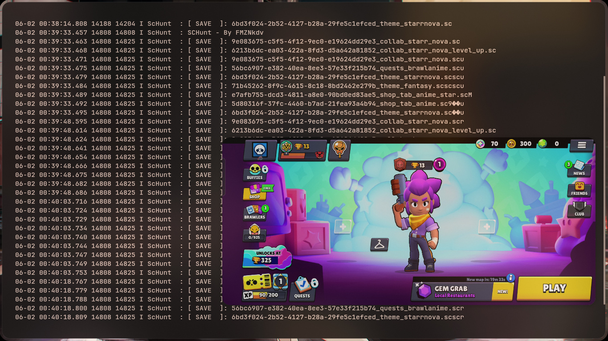

This is a library for intercepting event `.sc` files from the Supercell game cache. (non root)

## Requirements

- Zig (0.16.0)
- Linux (tested only on x86)
- Brain..? 🧑🏿‍🦯

## Download

```bash
git clone https://github.com/FMZNkdv/SCHunt.git
cd SCHunt
```

## Change
Change the package name in [init.zig](https://github.com/FMZNkdv/SCHunt/blob/main/Config/init.zig) to your own package

## Building

```bash
zig build-lib ScHunt.zig -target aarch64-linux-android -dynamic -O ReleaseSmall --name ScHunt --libc Android/libc.txt -lc -llog -L Ndk/
```

## Inject

```smali
const-string v0, "ScHunt"

invoke-static {v0}, Ljava/lang/System;->loadLibrary(Ljava/lang/String;)V
```

and place `libScHunt.so` in `lib/arm64-v8a/`

## Running

```bash
adb logcat -s ScHunt
```
